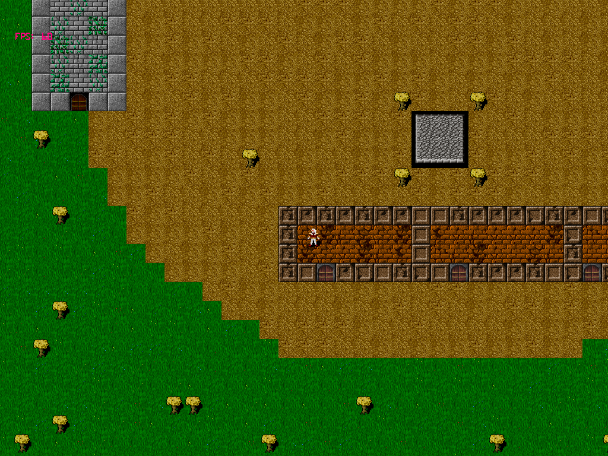

# Heidur

### Small - Casual - Multiplatform - RPG

#### Summary

   *En un lugar lleno de magia y misterio, una persona en busca de oportunidades y un destino comenzará a forjar su propia historia, a base de trabajo, habilidad, riquezas y descubirimientos. 
   Tu eres el elegido y unico capaz de lograr lo que nadie ha podido hacer...
   Buscar la verdad detras de este mundo?...
   Obtener riquezas y vivir una vida comoda?...
   Fama y fortuna?...
   Revelar los misterios ocultos en lo mas profundo de Heidur?...
   Proteger a los débiles?...
   La decision es tuya.*

#### Features
* Casual
* Singleplayer experience in a multiplayer connected world
* Epic list of jobs to do
* Active and passive combat
* Big World

#### Jobs

*   Carpintero
*   Herrero
*   Minero
*   Talador
*   Comerciante
*   Granjero
*   Pastor
*   Trabajador de cueros
*   Constructor
*   Arquitecto
*   Ladrillero
*   Cocinero
*   Medico
*   Cazador
*   Guardian
*   Asesino
*   Ladron
*   Caza-Recompensas
*   Explorador

### For more information
 * [See our one sheet sample]("Deprectaed")

##### Authors: 
* Jaime Gonzalez Bonorino ( Azokah - jaimegbonorino@gmail.com )
* Sebastian Pascual ( Repollo )

#Development 

#### MVP
*   Determinar MVP
    *  Un escenario(hecho)
    *  Arboles(hecho)
    *  Hacha
    *  Crafting con madera
    *  Venta de objetos
    *  Niveles y experiencia(hecho)

#### Mecanicas

*   Mecanica para un personaje que reacciona ante input
*   Mecanica para recolectar objetos
*   Mecanica para utilizar objetos para obtener recursos
*   Mecanica para crear objetos utilizando objetos
*   Mecanica para ganar experiencia y subir de nivel
*   Mecanica para generar misiones para los personajes
*   Mecanica para recompensar personajes que completan misiones
*   Mecanica para conectar jugadores de forma online