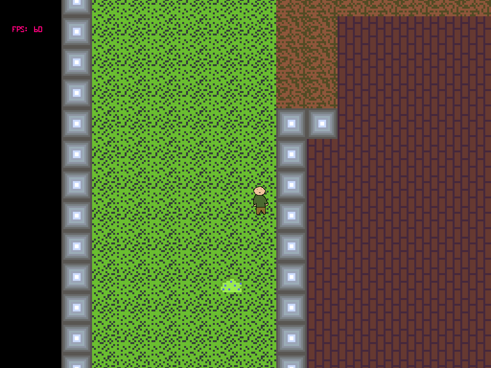

# Heidur

### Small - Casual - Multiplatform - RPG

#### Summary

   *In a place full of magic and mystery, a young man in search of opportunities gets the chance to work in the castle of one of the most powerful kings of Heidur. Soon the young man would discover that this job was not what he expected, but a promise is a promise, getting away is not an option. He will try determination and courage in an endless amount of adventures, to finally arrive at what seems to be the twisted end of the world, and with his own hands, to prevent it.*

#### Features
* Serious, big and original lore
* Lots of things to do, at your own time
* Casual
* Singleplayer experience in a multiplayer connected world

### For more information
 * [See our one sheet sample](docs/One%20sheet%20sample.pdf)

##### Authors: 
* Jaime Gonzalez Bonorino ( Azokah - jaimegbonorino@gmail.com )
* Sebastian Pascual ( Repollo )
